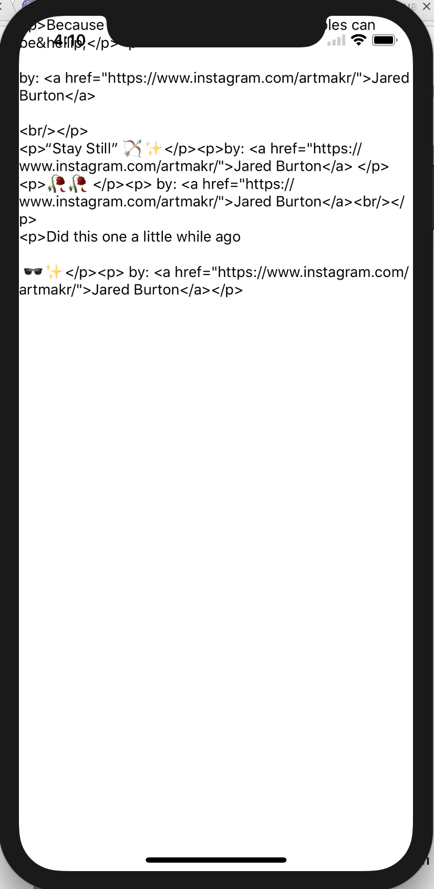

## Getting started
```bash
npm install -g create-react-native-app
create-react-native-app tumblr-native
cd tumblr-native
yarn start
```

## Milestone 0: Draw up architecture (together)

Draw up an architecture diagram of how you want your Tumblr app to look like.

App =>
- List of posts for _xxxx_
- Click through to individual post

## Milestone 1: Display basic posts

Get a Tumblr API key
- https://www.tumblr.com/oauth/apps

* Pull posts
  - https://api.tumblr.com/v2/blog/{blog}/posts/photo?api_key={key}&limit=4

* Store in data.json and create a TEST_DATA variable to store. Create a state parameter `posts` to store `TEST_DATA.response.posts`
  ```JSX
  this.state = {
    posts.TEST_DATA.response.posts
  }
  ```

* Create a `TumblrList` component and display state using a `FlatList`.
  ```JSX
  <FlatList
      data={this.props.posts}
      keyExtractor={(post) => post.id}
      renderItem={(postItem) => {
          return <Text>{postItem.item.caption}</Text>
      }}
  />
  ```
  ```JSX
  // Incorporate this into App.js
  <TumblrList posts={this.state.posts} />
  ```



* Create a `TumblrPost` component and incorporate into `TumblrList`. 
  ```JSX
  const img = {
    uri: this.props.photos[0].original_size.url
  };
  <View style={styles.container}>
    <Image 
        style={{width: 350, height: 400}}
        source={img} />
  </View>
  ```

(pic 2)

## Milestone 2: Fetch the data from the API

* Set state initialization
  ```JSX
  this.state = {
    posts: [],
    loading: false
  }
  ```

* Load data in componentWillMount
  ```JSX
    this.setState({
      loading: true
    }, () => {
      fetch(`${apiUrl}?api_key=${apiKey}&limit=4`)
        .then((data) => data.json())
        .then((json) => {
          this.setState({
            posts: json.response.posts,
            loading: false
          });
        });
    }); 
  ```

* Add a 2s promise wait so that we can actually see things load
  ```JSX
  .then((json) => {
    return new Promise(function(resolve, reject){
      setTimeout(function(){
        resolve(json);
      }, 2000);
    });
  })
  ```

* Abstract out a fetchWithPage
  ```JSX
  fetchWithPage(page) {
    // change fetch URL to use &offset=${page * 4}
  }
  ```
  ```JSX
  componentWillMount(props) {
    this.fetchWithPage(0);
  }
  ```
  ```JSX
  this.fetchWithPage = this.fetchWithPage.bind(this);
  ```

## Milestone 3: Infinite scrolling

* Create a `loadMore` function that increments page
  ```JSX
  this.state = {
    ...
    page: 0
  }
  ```
  ```JSX
  loadMore() {
    const newPage = this.state.page + 1;
    this.setState({
      page: newPage
    }, () => {
      this.fetchWithPage(newPage);
    });
  }
  ```
  ```JSX
  this.loadMore = this.loadMore.bind(this);
  ```

* Hook that function into the `FlatList` in `TumblrList`
  ```JSX
  <TumblrList ... loadMore={this.loadMore} loading={this.state.loading}/>
  ```
  ```JSX
  <FlatList
    ...
    refreshing={this.props.loading}
    onRefresh={this.props.loadMore} />
  ```

(pic 3)
(pic 4)

* Instead, use `onEndReached` and `onEndReachedThreshold` for infinite scrolling. Also, make sure to concatenate instead of replacing
  ```JSX
  <FlatList
    ...
    onEndReachedThreshold={0.05}
    onEndReached={this.props.loadMore}
    />
  ```
  ```JSX
  this.setState({
    posts: this.state.posts.concat(json.response.posts)
    ...
  });
  ```

* Add a `ListFooterComponent` into `FlatList` for style points
  ```JSX
  ListFooterComponent={() =>
      <View style={{flex: 1, padding: 10}}>
          <ActivityIndicator size="large" />
      </View>
  }
  ```

(pic 5)
(pic 6)

## Milestone 4: Navigation

* Make a TouchableHighlight around your TumblrPost

* Create a simple `TumblrProfile` (leave the default code)
  ```JSX
  <TouchableHighlight onPress={() => alert('test')}>
      <View>
          <Image ... />
      </View>
  </TouchableHighlight>
  ```

(pic 7)

* Install `react-navigation` and restart yarn
  ```bash
  yarn add react-navigation
  yarn start
  ```

* Create a simple `StackNavigator`
  ```JSX
  import {StackNavigator} from 'react-navigation';

  const Routes = StackNavigator({
    TumblrList: { screen: TumblrList }
  });
  ```

* Use `Routes` in render() and link in `screenProps`
  ```JSX
  <Routes 
    screenProps={{
      posts: this.state.posts,
      loadMore: this.loadMore,
      loading: this.state.loading
    }} />
  ```

* Link through `screenProps` in `TumblrList`
  ```JSX
  const props = this.props.screenProps;
  <FlatList
    ...
    data={props.posts}
    onEndReached={props.loadMore}
    refreshing={props.loading}
  />
  ```

(pic 8)

* Add `TumblrProfile` to `Routes`
  ```JSX
  const Routes = StackNavigator({
    TumblrList: { screen: TumblrList },
    TumblrProfile: {screen: TumblrProfile}
  });
  ```

* In `TumblrList`, create a loadProfile function that links through to `TumblrPost`
  ```JSX
  const { navigate } = this.props.navigation;
  return (
    <FlatList
      ...
      renderItem={(postItem) => {
        return <TumblrPost {...postItem.item} loadProfile={() => navigate('TumblrProfile')}/>
      }}
    />
  )
  ```

* Pass through item in the navigate function

* Use this function in `TumblrPost` for `onPress`
  ```JSX
  <TouchableHighlight onPress={this.props.loadProfile}>
  ```

(pic)

* Install HTMLView
  ```bash
  yarn add react-native-htmlview
  ```
  ```JSX
  import HTMLView from 'react-native-htmlview';
  ```

* In `TumblrProfile.render()`, consume navigation state
  ```JSX
  const props = this.props.navigation.state.params;
  const img = {
      uri: props.photos[0].original_size.url
  };
  return (
    <View>
      <Image
          style={{width: 350, height: 400}}      
          source={img}
      />
      <View>
          <HTMLView
              value={props.caption} />
      </View>
    </View>
  );
  ```

* Add a title using `navigationOptions`
  ```JSX
  const Routes = StackNavigator({
    TumblrList: { screen: TumblrList },
    TumblrProfile: { 
      screen: TumblrProfile,
      navigationOptions: ({navigation}) => ({
        title: `${navigation.state.params.summary}`
      })
    }
  });
  ```

(pic)


## Bonus 1: Improve look and feel
A few ideas:
- Use smaller photo so it looks faster
- Better styling
- [Better animations](
https://reactnavigation.org/docs/navigators/stack#Modal-StackNavigator-with-Custom-Screen-Transitions)

## Bonus 2: Be able to browse to different blogs

## Bonus 3: Display video and audio blogs

https://api.tumblr.com/v2/blog/{blog}/posts/video?api_key={key}&limit=4

https://api.tumblr.com/v2/blog/{blog}/posts/audio?api_key={key}&limit=4
